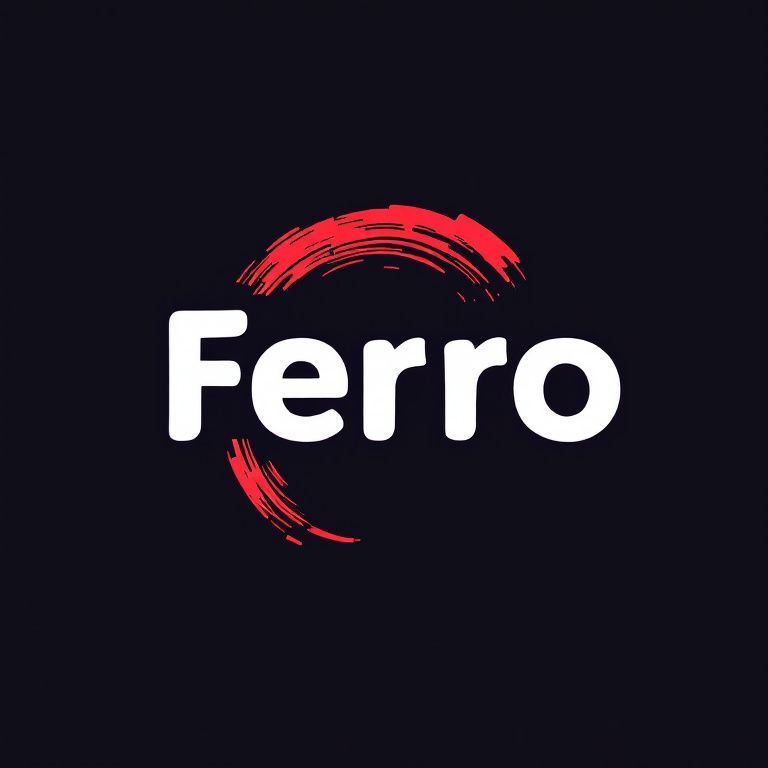

A rust base llm wrapper for generating git commits and descriptions

## How to read
This readme can be read _As-Is_ but youll be missing some nice visuals. If you want to see those, you need two tools:
1. [graph-easy](http://bloodgate.com/perl/graph/manual/overview.html)
2. [slides](https://github.com/maaslalani/slides)

figure out how to get those installed on your OS and then come back, otherwise, continue on...

## Fun Facts
### Scientific Roots
1. Ferrum: Latin for iron, reflecting Rust's iron/oxidation themes.
2. Ferro-: Greek prefix meaning iron or iron-containing.

### Relevant Connections
1. Ferrocene: An iron-containing compound.
2. Ferroelectric: Materials exhibiting iron-like electrical properties.

### Simple, Modern Sound
"Ferro" is concise, memorable and has a technical feel, fitting for a Rust CLI tool.

*continue to architecture on next page*

---

## Architecture
I just wanted to split things up in a cohesive way. Where one node is resposible for its own thing and returns whatever
data, it creates, to its caller

```
this is a graph demonstrating the mvp architecture

~~~graph-easy --as=boxart
graph { flow: east; }
[main]->{start:front; end:back}[arg parser]
[arg parser] -> {start:front,0; end:back;} [pr handler]
[arg parser] -> {start:front,0; end:back;} [commit handler]
[pr handler], [commit handler] -> {start:front; end:back,0;} [ml interface]
[ml interface] -> [out]

[commit handler] -> {end: back,0;} [git grabber]
[pr handler] -> {end: back,0;} [git grabber]
~~~
```

*continue to next slide to see mvp v2 architecture*

---

```
this is a graph demonstrating the mvp (v2) architecture

~~~graph-easy --as=boxart
graph { flow: east; }
[main]->{start:front; end:back}[arg parser]
[arg parser] -> {start:front,0; end:back;} [pr handler]
[arg parser] -> {start:front,0; end:back;} [commit handler]
[pr handler], [commit handler] -> {start:front; end:back,0;} [ml interface]
[ml interface] -> [out]

[commit handler] -> {end: front,0;} [git grabber]
[pr handler] -> {end: front,0;} [git grabber]
[config loader]{ origin: main; offset: 0,-2; } -> {start:right; end:left} [main]
[interactive] { origin: arg parser; offset: 0,-2; } <== no args ==> {start:right; end:left}[arg parser]
~~~
```

---

# How to use
from within a git repo you can do the following

## commit
*ensure you have staged files*
```bash
ferro -c
# or if you want to blindly accept what it spits out (fire and forget)
git commit -m $(ferro -c)

```

## pull request
*this just generates the contents for you to populate a PR with*
```bash
ferro -p
```
